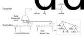

# Roosterize

Roosterize is a tool for suggesting lemma names in verification
projects that use the [Coq proof assistant](https://coq.inria.fr).
The tool leverages neural networks that take serialized Coq
lemma statements and elaborated terms as input; see the [Technique](#Technique)
section below.

## Requirements

- Linux or macOS
- [OCaml 4.07.1](https://ocaml.org)
- [SerAPI 0.7.1](https://github.com/ejgallego/coq-serapi)
- [Coq 8.10.2](https://coq.inria.fr/download)
- [Python 3.7](https://www.python.org)
- [PyTorch 1.1.0](https://pytorch.org/get-started/previous-versions/#v110)

## Installation

You can install Roosterize from source code by cloning this GitHub
repository and setting up the dependencies following steps 1 & 2.
(Alternatively, you can download the a [binary
distribution](https://github.com/EngineeringSoftware/roosterize/releases)
which already contains the Python dependencies, and then you only need
step 1.)

```
git clone https://github.com/EngineeringSoftware/roosterize.git
cd roosterize
```

### 1. Installation of OCaml, Coq, and SerAPI

We strongly recommend installing the required versions of OCaml, Coq,
and SerAPI via the [OPAM package manager](https://opam.ocaml.org),
version 2.0.7 or later.

To set up the OPAM-based OCaml environment, use:
```
opam switch create roosterize 4.07.1
opam switch roosterize
eval $(opam env)
```
Then, install Coq and SerAPI, pinning them to avoid unintended upgrades:
```
opam update
opam pin add coq 8.10.2
opam pin add coq-serapi 8.10.0+0.7.1
```

### 2. Installation of PyTorch and Python libraries

We strongly recommend installing the required versions of Python and
PyTorch using [Conda](https://docs.conda.io/en/latest/miniconda.html).

To set up the Conda environment, use one of the following command
suitable for your operating system and whether you want to use it on a
CPU or GPU.

- Linux, CPU:
```
conda env create --name roosterize --file conda-envs/cpu.yml
```

- Linux, GPU w/ CUDA 10.0:
```
conda env create --name roosterize --file conda-envs/gpu-cuda10.yml
```

- Linux, GPU w/ CUDA 9.0:
```
conda env create --name roosterize --file conda-envs/gpu-cuda9.yml
```

- Mac, CPU:
```
conda env create --name roosterize --file conda-envs/mac-cpu.yml
```

Finally, activate the Conda environment before using Roosterize:
```
conda activate roosterize
```

### Installation of trained models

Next, you need to obtain a pre-trained model that capture naming
conventions.  The default pre-trained model, which was trained using
our [corpus][math-comp-corpus] and follows the conventions used in the
[Mathematical Components][math-comp-website] family of projects, can
be obtained by running the command:

```
./bin/roosterize download_global_model
```

The model will be downloaded to `$HOME/.roosterize/`. To use a
different model (that we [released][latest-release] or you trained),
simply put it in `$HOME/.roosterize/`.

## Usage

To use Roosterize on a Coq verification project, you first need to
build the Coq project using a command provided by the project (usually
`make`).  Then, run this command to get the lemma name suggestions for
the lemmas in a Coq document (.v file):

```
python -m roosterize.main suggest_naming --file=PATH_TO_FILE
```

Roosterize automatically infers the root directory of the project by
finding `_CoqProject`, and reads `_CoqProject` to infer the SerAPI
command line options (for mapping logical paths to directories, see
[SerAPI's documentation][serapi-faq-link]).  If you don't have a
`_CoqProject` file, you need to provide an additional argument
`--project_root=PATH_TO_PROJECT_ROOT`.

<!-- where `$PATH_TO_PROJECT` should be replaced with the path to the -->
<!-- Coq project, and `$SERAPI_OPTIONS` should be replaced with the SerAPI -->
<!-- command line options for mapping logical paths to directories -->
<!-- (see [SerAPI's documentation][serapi-faq-link]). For example, -->
<!-- if the logical path (inside Coq) for the project is `Verified`, -->
<!-- you should set `SERAPI_OPTIONS="-R $PATH_TO_PROJECT,Verified"`. -->

The above command extracts all lemmas from the file, uses the
pre-trained model to generate likely lemma names for each lemma, and
finally prints the lemma name update suggestions, i.e., the generated
lemma names that are different from to the existing ones.  See an
[example suggestion report](./docs/example-suggestion.txt).

For other usages and command line interfaces of Roosterize, please
check the help:
```
python -m roosterize.main help
```

[latest-release]: https://github.com/EngineeringSoftware/roosterize/releases/latest
[serapi-faq-link]: https://github.com/ejgallego/coq-serapi/blob/v8.10/FAQ.md#does-serapi-support-coqs-command-line-flags

## Technique

Roosterize learns and suggests lemma names using neural networks
that take serialized Coq lemma statements and elaborated terms as input.
For example, the Coq lemma sentence
```coq
Lemma mg_eq_proof L1 L2 (N1 : mgClassifier L1) : L1 =i L2 -> nerode L2 N1.
```
is serialized into the following tokens (simplified):
```lisp
(Sentence((IDENT Lemma)(IDENT mg_eq_proof)(IDENT L1)(IDENT L2)
  (KEYWORD"(")(IDENT N1)(KEYWORD :)(IDENT mgClassifier)
  (IDENT L1)(KEYWORD")")(KEYWORD :)(IDENT L1)(KEYWORD =i)(IDENT L2)
  (KEYWORD ->)(IDENT nerode)(IDENT L2)(IDENT N1)(KEYWORD .)))
```
and the corresponding elaborated term (simplified):
```lisp
(Prod (Name (Id char)) ... (Prod (Name (Id L1)) ...
 (Prod (Name (Id L2)) ... (Prod (Name (Id N1)) ...
  (Prod Anonymous (App (Ref (DirPath ((Id ssrbool) (Id ssr) (Id Coq))) (Id eq_mem)) ...
   (Var (Id L1)) ... (Var (Id L2)))
  (App (Ref (DirPath ((Id myhill_nerode) (Id RegLang))) (Id nerode)) ...
   (Var (Id L2)) ... (Var (Id N1))))))))
```

The diagram below illustrates Roosterize's neural network
architecture, as applied to this example:



Our [research paper][arxiv-paper] outlines the design of Roosterize,
and describes an evaluation on a [corpus][math-comp-corpus]
of serialized Coq code derived from the [Mathematical Components][math-comp-website]
family of projects. The training, validation, and testing sets of Coq files from the corpus
used in the evaluation are defined in the `training` directory.

If you have used Roosterize in a research project, please cite
the research paper in any related publication:
```bibtex
@inproceedings{NieETAL20Roosterize,
  author = {Nie, Pengyu and Palmskog, Karl and Li, Junyi Jessy and Gligoric, Milos},
  title = {Deep Generation of {Coq} Lemma Names Using Elaborated Terms},
  booktitle = {International Joint Conference on Automated Reasoning},
  pages = {97--118},
  doi = {10.1007/978-3-030-51054-1_6},
  year = {2020},
}
```

[arxiv-paper]: https://arxiv.org/abs/2004.07761
[math-comp-corpus]: https://github.com/EngineeringSoftware/math-comp-corpus
[math-comp-website]: https://math-comp.github.io

## Authors

- [Pengyu Nie](https://cozy.ece.utexas.edu/~pynie/)
- [Karl Palmskog](https://setoid.com)
- [Emilio Jesús Gallego Arias](https://www.irif.fr/~gallego/)
- [Junyi Jessy Li](http://jessyli.com)
- [Milos Gligoric](http://users.ece.utexas.edu/~gligoric/)
